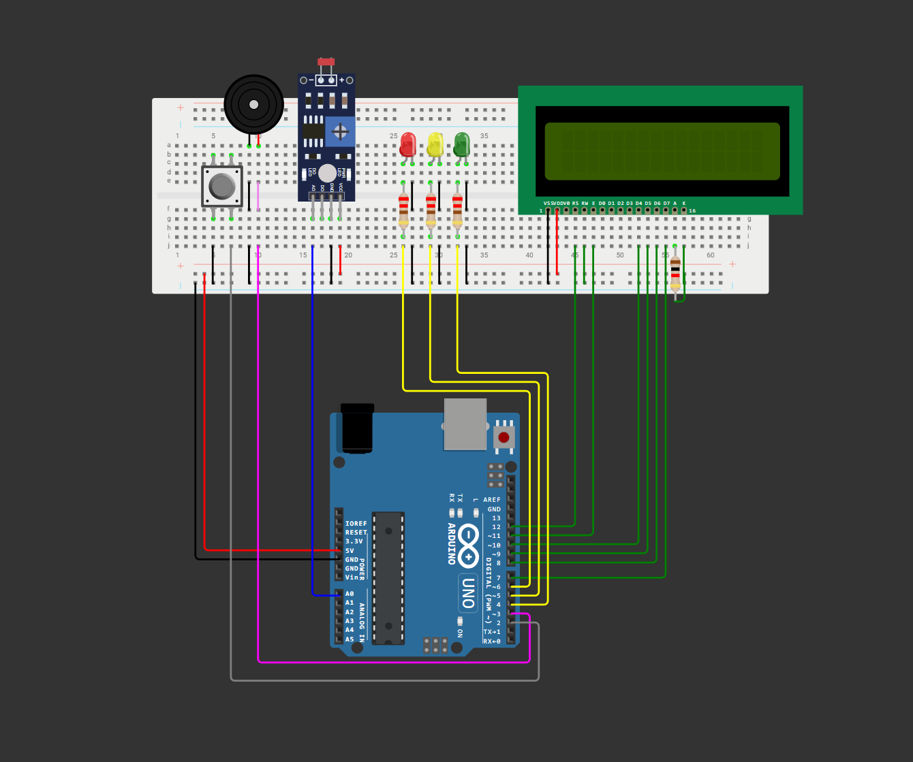

# Vinheria Agnello – Monitoramento de Luminosidade com Arduino


gi
Projeto desenvolvido como parte do desafio acadêmico proposto pela FIAP, com base no cenário fictício da empresa **Vinheria Agnello**. Este sistema embarcado tem como objetivo monitorar a luminosidade do ambiente, garantindo que os vinhos sejam armazenados sob condições ideais de conservação.

O projeto utiliza um sensor LDR para detectar a luz ambiente, realiza calibração dinâmica, apresenta o status via display LCD e aciona alertas visuais (LEDs) e sonoros (buzzer) conforme o nível de luminosidade.

---

## Circuito

<p align="center">
  
</p>

---

## Funcionalidades

- Exibição de animação de boas-vindas no LCD
- Calibração automática da luminosidade mínima e máxima
- Conversão das leituras do sensor em escala percentual (0% a 100%)
- Sinalização visual com 3 LEDs:
  - **Verde**: nível ideal
  - **Amarelo**: nível de atenção
  - **Vermelho + buzzer**: luz excessiva
- Exibição contínua do nível de luz atual no display LCD

---

## Componentes Utilizados

| Componente         | Quantidade | Descrição                                     |
|--------------------|------------|-----------------------------------------------|
| Arduino Uno        | 1x         | Microcontrolador principal                    |
| Sensor LDR         | 1x         | Sensor de luminosidade                        |
| Display LCD 16x2   | 1x         | Interface de exibição                         |
| LEDs (RGB)         | 3x         | Sinalização: verde, amarelo e vermelho        |
| Buzzer             | 1x         | Alerta sonoro para luminosidade crítica       |
| Push Button        | 1x         | Botão para calibração                         |
| Resistores 220Ω    | 3x         | Para os LEDs                                  |
| Resistor 10kΩ      | 1x         | Para o sensor LDR                             |
| Protoboard         | 1x         | Montagem do circuito                          |
| Jumpers            | Diversos   | Conexões entre os componentes                 |

---

## Estrutura do Projeto

```
vinheria_agnello/
├── vinheria_agnello.ino         # Código principal do sistema embarcado
├── imgs/
│   └── image_circuit.png        # Imagem do circuito no WokWI
README.md                        # Documentação do projeto
LICENSE                          # Licença do projeto (MIT)
```

---

## Como Replicar este Projeto

1. **Plataforma recomendada:** Arduino IDE (ou simulação via [WokWI](https://wokwi.com))
2. **Monte o circuito** conforme o diagrama disponível em `imgs/image_circuit.png`
3. **Carregue o código** presente no arquivo `vinheria_agnello.ino`
4. **Alimente o circuito** com 5V
5. **Pressione o botão** quando solicitado para realizar a calibração de luz mínima e máxima
6. O sistema iniciará o monitoramento automaticamente após a calibração

---

## Lógica do Sistema

- Ao iniciar, o sistema mostra uma animação no LCD e entra no modo de calibração
- A calibração é feita manualmente pressionando o botão em dois momentos:
  - **Primeira vez:** define a luminosidade mínima
  - **Segunda vez:** define a luminosidade máxima
- A cada ciclo, o sensor LDR realiza 10 leituras com espaçamento de 100ms
- A média das leituras é convertida em uma porcentagem
- O valor percentual é exibido no display
- Dependendo do nível:
  - **≤ 40%**: LED verde aceso
  - **> 40% e ≤ 70%**: LED amarelo aceso
  - **> 70%**: LED vermelho + buzzer ativo por 3 segundos

---

## Requisitos

- Arduino IDE 1.8+ ou simulação via [WokWI](https://wokwi.com)
- Biblioteca: `LiquidCrystal.h` (já inclusa por padrão na IDE)

---

## Equipe

| Nome               | Função            |
|--------------------|-------------------|
| Anthony Sforzin    | Desenvolvimento   |
| Luigi Cabrini      | Desenvolvimento   |
| Bruno K            | Desenvolvimento   |
| Rogério Arroyo     | Desenvolvimento   |
| Thayná Simões      | Desenvolvimento   |

---

## Licença

Este projeto está licenciado sob os termos da licença MIT. Consulte o arquivo [`LICENSE`](LICENSE) para mais detalhes.

---

<p align="center"><b>Desenvolvido com dedicação pela equipe Stratfy</b></p>
